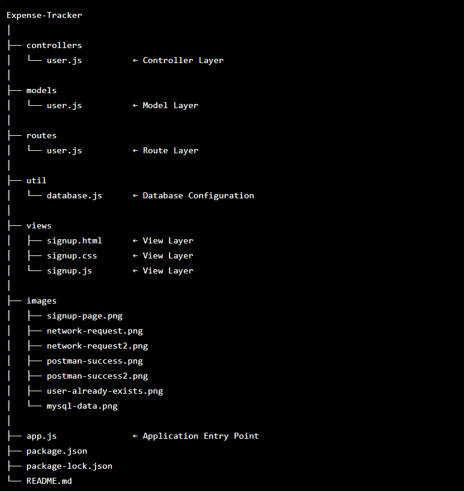
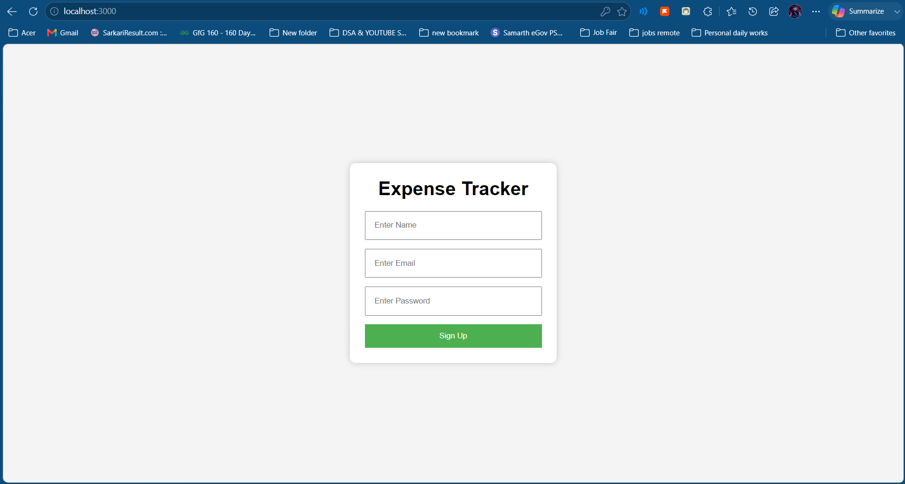
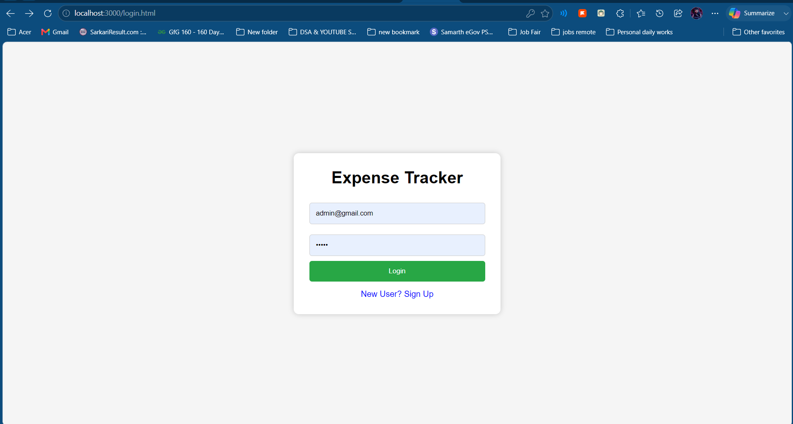
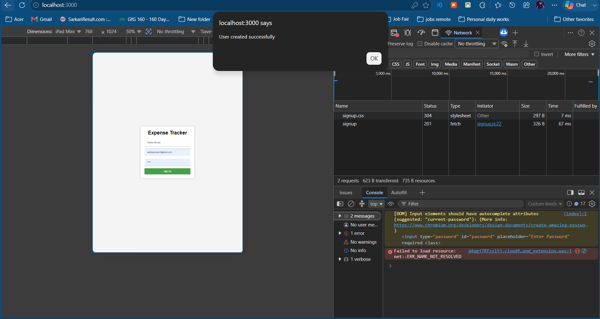
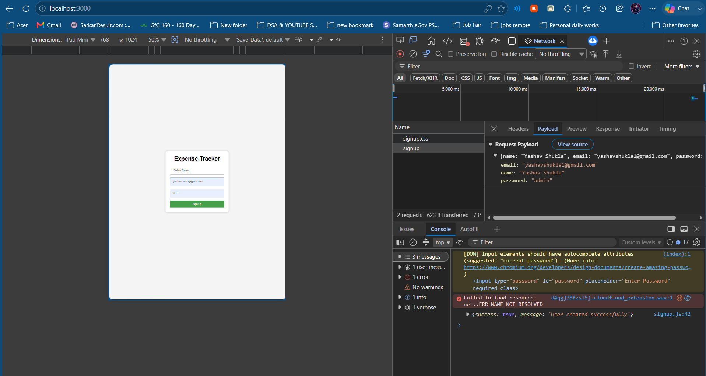
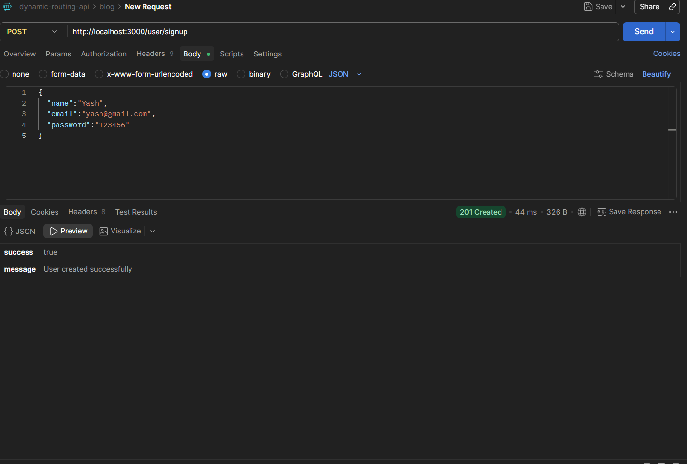
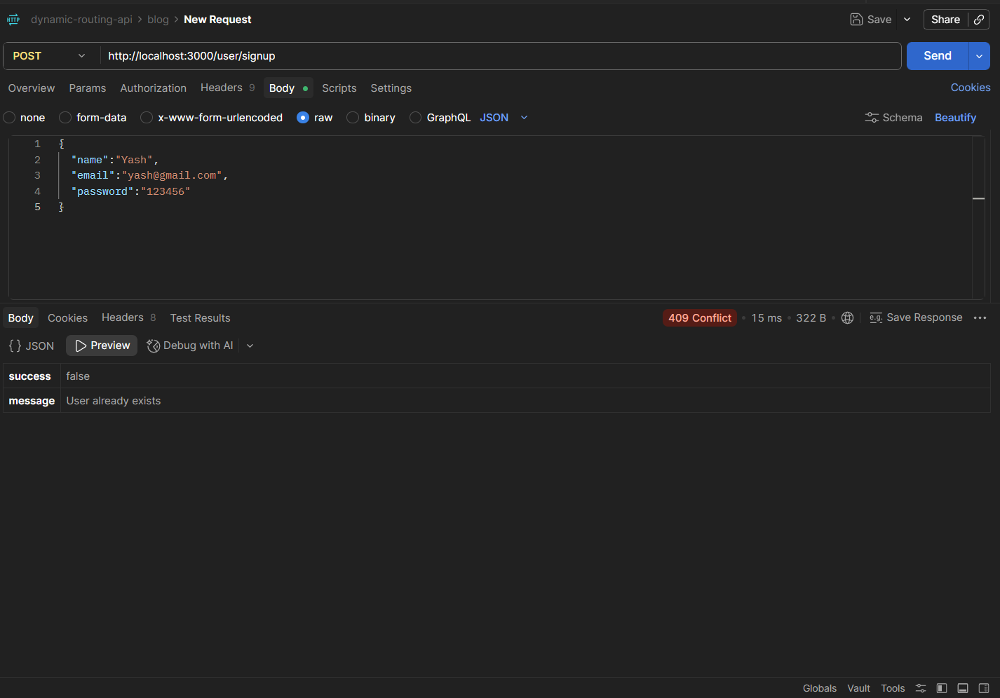
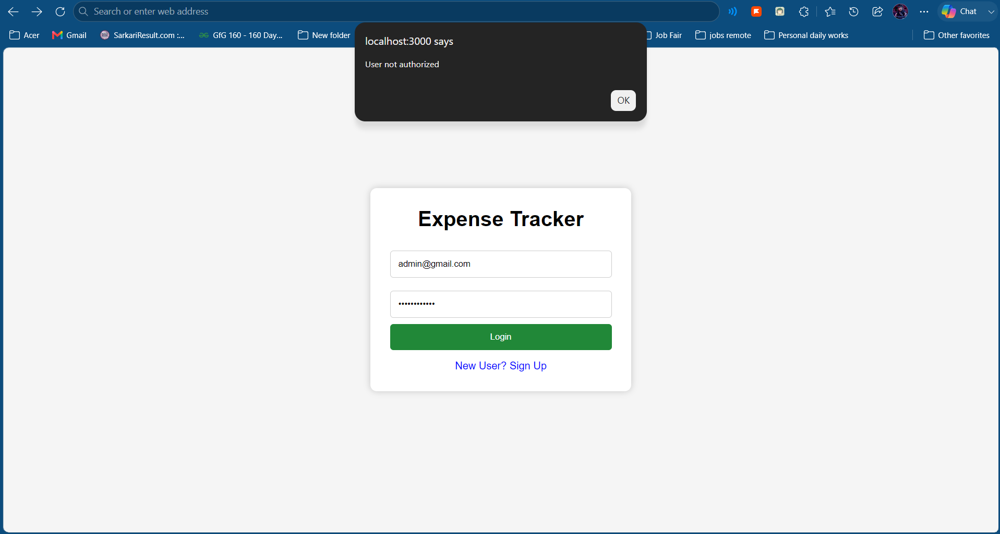
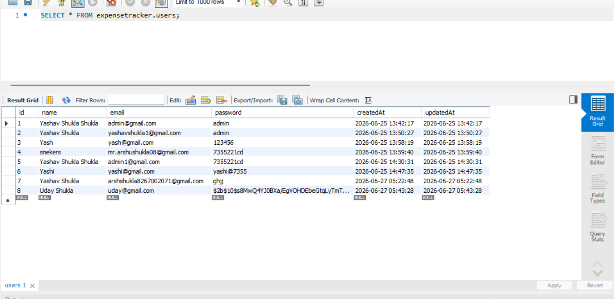
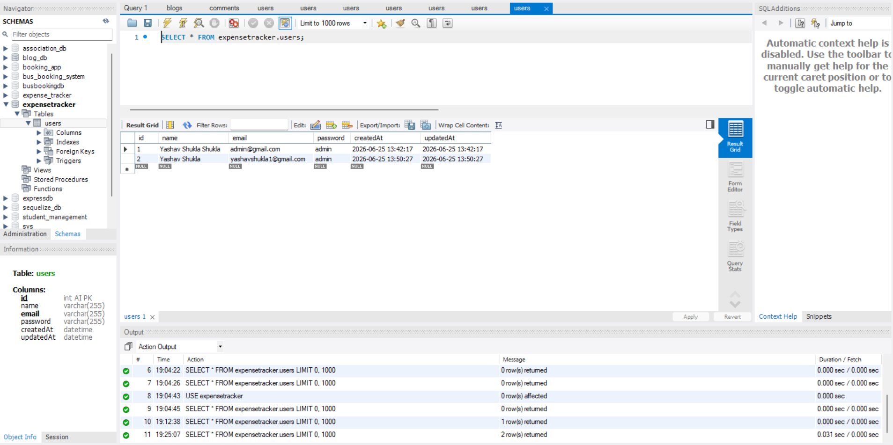

<p align="center">
  <h1 align="center">Expense Tracker - Secure User Authentication System</h1>
</p>

<p align="center">
  A secure User Authentication Module for the Expense Tracker application built using Node.js, Express.js, MySQL, Sequelize ORM, and bcrypt following MVC Architecture.
</p>

<p align="center">
  
  
  
  
   
  
  
</p>

---

## 📌 Project Overview

This project implements the **Secure User Authentication System** for the Expense Tracker application.

Users can:

* Create a new account using Signup
* Login using registered credentials
* Prevent duplicate registrations
* Validate user credentials securely
* Secure passwords using bcrypt hashing
* Store user data in MySQL Database

The project follows the **MVC (Model-View-Controller)** Architecture and uses **Sequelize ORM** for database operations.

---

## ✨ Features

* User Registration (Signup)
* User Login Authentication
* Secure Password Verification
* Password Hashing using bcrypt
* Duplicate User Validation
* Password Verification
* MySQL Database Integration
* Sequelize ORM
* REST API Implementation
* MVC Architecture
* Frontend & Backend Integration
* Error Handling with HTTP Status Codes
* HTTP Status Code Handling

---

## 🔐 Password Security

### Before bcrypt

Database stored passwords like:

```text
123456
admin123
password
```

This is unsafe because anyone with database access can view user passwords.

### After bcrypt

Passwords are stored as hashes:

```text
$2b$10$RkK9j...  
$2b$10$gXfP7...
```

Actual passwords are never stored in plain text.

### Signup Flow

```text
User Password
      │
      ▼
bcrypt.hash()
      │
      ▼
MySQL Database
```

### Login Flow

```text
User Password
      │
      ▼
bcrypt.compare()
      │
      ▼
Authentication Result
```

---

## 🛠 Tech Stack

* Node.js
* Express.js
* bcrypt
* MySQL
* Sequelize ORM
* JavaScript
* HTML5
* CSS3
* Axios
* CORS

---

## 📁 Project Structure

```text
expense-tracker
│
├── controllers
│   └── user.js
│
├── models
│   └── user.js
│
├── routes
│   └── user.js
│
├── util
│   └── database.js
│
├── views
│   ├── signup.html
│   ├── signup.css
│   ├── signup.js
│   ├── login.html
│   ├── login.css
│   └── login.js
│
├── images
│   ├── signup-page.png
│   ├── login-page.png
│   ├── network-request.png
│   ├── network-request2.png
│   ├── postman-success.png
│   ├── postman-success2.png
│   ├── login-success.png
│   ├── unauthorized-user.png
│   ├── user-not-found.png
│   ├── mysql-data.png
│   ├── hashed-password.png
│   └── mvc-architecture.png
│
├── app.js
├── package.json
└── README.md
```

---

## 🔐 Authentication APIs

### Signup API

```http
POST /user/signup
```

### Request Body

```json
{
  "name": "Yash",
  "email": "yash@gmail.com",
  "password": "123456"
}
```

### Process

```text
Validate User
       ↓
Check Existing Email
       ↓
bcrypt.hash()
       ↓
Store Hashed Password
       ↓
Success Response

```

### Success Response

```json
{
  "message": "User created successfully"
}
```

Status Code:

```text
201 Created
```

### Duplicate User Response

```json
{
  "message": "User already exists"
}
```

Status Code:

```text
409 Conflict
```

---

### Login API

```http
POST /user/login
```

### Request Body

```json
{
  "email": "yash@gmail.com",
  "password": "123456"
}
```

### Process

```text
Find User
      ↓
bcrypt.compare()
      ↓
Password Match ?
      ↓
Login Success
```

### Successful Login

```json
{
  "message": "User login successful"
}
```

Status Code:

```text
200 OK
```

### Invalid Password

```json
{
  "message": "User not authorized"
}
```

Status Code:

```text
401 Unauthorized
```

### User Not Found

```json
{
  "message": "User not found"
}
```

Status Code:

```text
404 Not Found
```

---

## 📤 Authentication Flow

```text
User
 ↓
Frontend Form
 ↓
Axios POST Request
 ↓
Route
 ↓
Controller
 ↓
Model
 ↓
MySQL Database
 ↓
Response
 ↓
Frontend Alert
```

---

## 🗃 User Table Schema

| Field    | Type    |
| -------- | ------- |
| id       | INTEGER |
| name     | STRING  |
| email    | STRING  |
| password | STRING  |

---

## 🏗 MVC Architecture

### View

```text
signup.html
signup.css
signup.js

login.html
login.css
login.js
```

### Controller

```text
controllers/user.js
```

Responsibilities:

```text
Receive Requests
Validate Data
Check Existing Users
Verify Login Credentials
Send Responses
```

### Model

```text
models/user.js
```

Responsibilities:

```text
Database Operations
Store User Data
Manage User Records
```

### MVC Architecture Diagram



---

## MVC Flow Diagram

```text
┌─────────────────────┐
│       VIEW          │
│ HTML • CSS • JS     │
└──────────┬──────────┘
           │
           ▼
┌─────────────────────┐
│      ROUTES         │
│ routes/user.js      │
└──────────┬──────────┘
           │
           ▼
┌─────────────────────┐
│    CONTROLLER       │
│ controllers/user.js │
└──────────┬──────────┘
           │
           ▼
┌─────────────────────┐
│       MODEL         │
│ models/user.js      │
└──────────┬──────────┘
           │
           ▼
┌─────────────────────┐
│   MYSQL DATABASE    │
└─────────────────────┘
```

---

## 📸 Project Screenshots

### Signup Page



### Login Page



### Network Requests





### Successful Responses






### Error Handling




### Password Bcrypt



### Database Records



---

## 🚀 Future Improvements

* JWT Authentication
* Forgot Password Feature
* Expense Management APIs
* Premium Membership Features
* Razorpay Integration
* AWS Deployment

---

## 👨‍💻 Author

<p align="center">
  <a href="https://github.com/yashav-shukla">
    
  </a>
</p>

<h3 align="center">
  <a href="https://github.com/yashav-shukla">Yashav Shukla</a>
</h3>

<p align="center">
  Node.js • Express.js • MySQL • JavaScript
</p>

<p align="center">
  <a href="https://github.com/yashav-shukla">
    🌐 GitHub Profile
  </a>
</p>

---

<p align="center">
⭐ If you found this project helpful, consider giving it a star on GitHub!
</p>

<p align="center">
  
</p>
