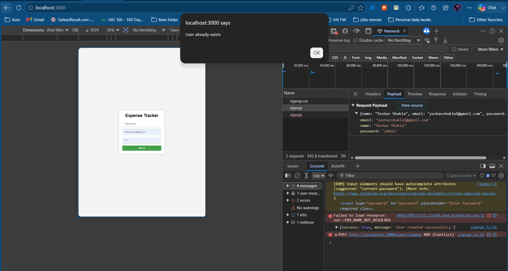

<p align="center">
  <h1 align="center">Expense Tracker - Signup Backend API</h1>
</p>

<p align="center">
  A backend API for user registration in the Expense Tracker application built using Node.js, Express.js, MySQL, and Sequelize ORM.
</p>

<p align="center">
  <p align="center">       </p>
</p>

---

## 📌 Project Overview

This project implements the **Signup Backend API** for the Expense Tracker application.

The API accepts user registration details from the frontend:

* Name
* Email
* Password

The backend validates the request, checks for duplicate users, and stores user information in a MySQL database using Sequelize ORM.

This module represents the **Model and Controller Layers** of the MVC Architecture.

---

## ✨ Features

* User Registration API
* MySQL Database Integration
* Sequelize ORM
* Duplicate User Validation
* REST API Implementation
* MVC Architecture
* JSON Request & Response Handling
* Frontend Integration Ready

---

## 🛠 Tech Stack

* Node.js
* Express.js
* MySQL
* Sequelize ORM
* JavaScript
* CORS

---

## 📁 Project Structure

```text
expense-tracker-signup-api
│
├── controllers
│   └── user.js
│
├── models
│   └── user.js
│
├── routes
│   └── user.js
│
├── util
│   └── database.js
│
├── views
│   ├── signup.html
│   ├── signup.css
│   └── signup.js
│
├── images
│   ├── signup-page.png
│   ├── network-request.png
│   ├── network-request2.png
│   ├── postman-success.png
│   ├── postman-success2.png
│   ├── user-already-exists.png
│   ├── mysql-data.png
│   └── mvc-architecture.png
│
├── app.js
├── package.json
└── README.md
```

---

## ⚙️ Installation

Clone the repository:

```bash
git clone https://github.com/yourusername/expense-tracker-signup-api.git
```

Navigate to the project folder:

```bash
cd expense-tracker-signup-api
```

Install dependencies:

```bash
npm install
```

---

## 🗄 Database Setup

Create a MySQL database:

```sql
CREATE DATABASE expensetracker;
```

Configure your database credentials inside:

```text
util/database.js
```

---

## ▶️ Run the Project

Start the server:

```bash
node app.js
```

Expected Output:

```text
Server running on port 3000
```

---

## 🌐 API Endpoint

### POST `/user/signup`

The API accepts user details and stores them in the database.

### Request Body

```json
{
  "name": "Yash",
  "email": "yash@gmail.com",
  "password": "123456"
}
```

### Success Response

```json
{
  "success": true,
  "message": "User created successfully"
}
```

Status Code:

```text
201 Created
```

### Duplicate User Response

```json
{
  "success": false,
  "message": "User already exists"
}
```

Status Code:

```text
409 Conflict
```

---

## 📤 Signup Flow

```text
User
 ↓
Frontend Signup Form
 ↓
POST Request
 ↓
Route
 ↓
Controller
 ↓
Model
 ↓
MySQL Database
 ↓
Response Sent Back
```

---

# 🗃 User Table Schema

| Field    | Type    |
| -------- | ------- |
| id       | INTEGER |
| name     | STRING  |
| email    | STRING  |
| password | STRING  |

---

## 🏗 MVC Architecture

This assignment implements the **Controller** and **Model** layers.

### View

Frontend Layer

Files:

```text
signup.html
signup.css
signup.js
```

### Controller

Handles incoming requests and business logic.

Files:

```text
controllers/user.js
```

Responsibilities:

```text
Receive Requests
Validate Data
Check Existing Users
Send Responses
```

### Model

Handles database operations.

Files:

```text
models/user.js
```

Responsibilities:

```text
Database Operations
Store User Data
Manage User Records
```


### MVC Architecture Diagram


---


## MVC Flow Diagram

```text
┌─────────────────────┐
│       VIEW          │
│ signup.html         │
│ signup.css          │
│ signup.js           │
└──────────┬──────────┘
           │
           ▼
┌─────────────────────┐
│      ROUTES         │
│ routes/user.js      │
└──────────┬──────────┘
           │
           ▼
┌─────────────────────┐
│    CONTROLLER       │
│ controllers/user.js │
└──────────┬──────────┘
           │
           ▼
┌─────────────────────┐
│       MODEL         │
│ models/user.js      │
└──────────┬──────────┘
           │
           ▼
┌─────────────────────┐
│   MYSQL DATABASE    │
└─────────────────────┘
```

## 📸 Project Screenshots

### Signup Page


### Network Request


### Successful Signup


### Duplicate User Validation



### MySQL Database Records


---

## 🧪 Testing Using Postman

Method:

```http
POST
```

URL:

```http
http://localhost:3000/user/signup
```

Body:

```json
{
  "name": "Test User",
  "email": "test@gmail.com",
  "password": "123456"
}
```

---

## 🚀 Future Improvements

* Login API
* Password Encryption using bcrypt
* JWT Authentication
* Forgot Password Feature
* Expense Management APIs
* Premium Membership Features
* AWS Deployment

---


## 👨‍💻 Author

<p align="center">
  <a href="https://github.com/yashav-shukla">
    
  </a>
</p>

<h3 align="center">
  <a href="https://github.com/yashav-shukla">Yashav Shukla</a>
</h3>

<p align="center">
  Node.js • Express.js • MySQL • JavaScript
</p>

<p align="center">
  <a href="https://github.com/yashav-shukla">
    🌐 GitHub Profile
  </a>
</p>

---
<p align="center">
    ⭐ If you found this project helpful, consider giving it a star on GitHub!
</p>

<p align="center">
  
</p>